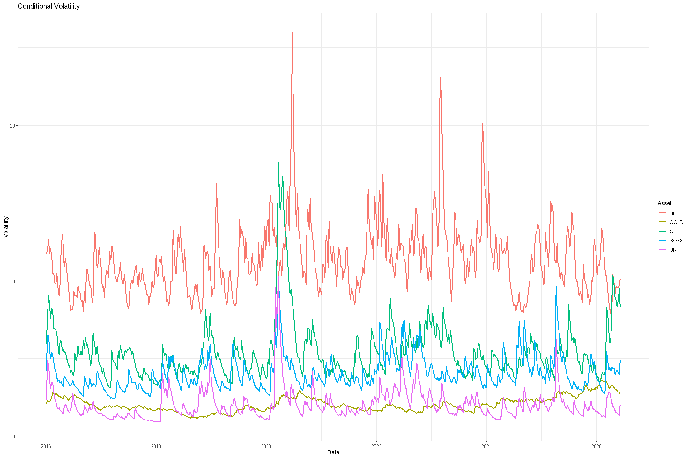
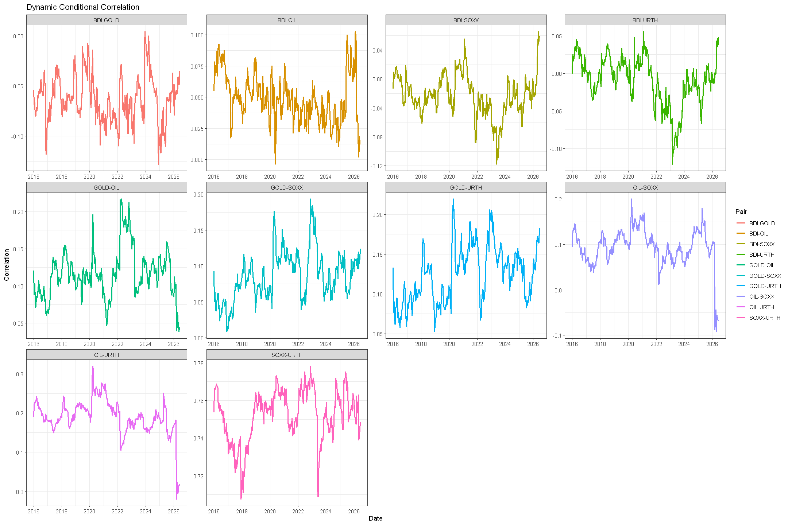
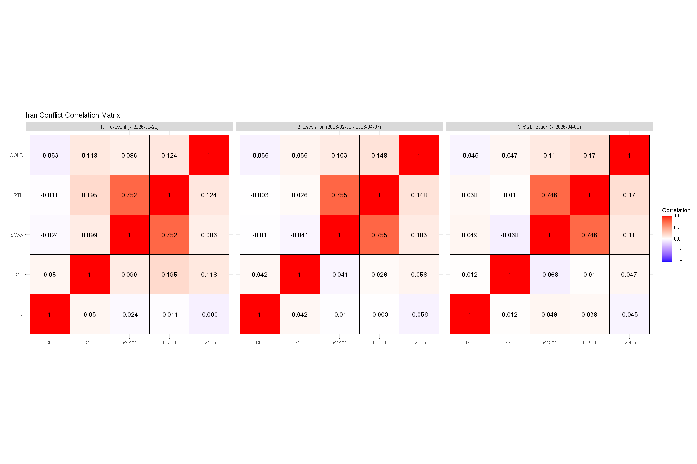

# Dynamic Conditional Correlation Modelling

Autocorrelation in squared returns suggests that volatility tends to cluster over time rather than occur randomly. This phenomenon is known as **volatility clustering**, and can be captured using **observation-driven models** which estimate unobserved time-varying parameters using lagged dependent variables. The **DCC-GARCH model** is an extended, multivariate variant of an observation-driven model, which can be used to capture volatility clustering. Unlike other multivariate GARCH models, the DCC extension allows for co-dependencies when computing covariances, a small dimensionality, and a positive definite covariance matrix $\Sigma_t$.

## Overview
The project investigates volatility clustering by assessing the time-varying, conditional correlation between several assets, driven by geopolitical choke points in 2026 using the DCC-GARCH(1,1) model. The repository serves as a medium for gaining practical insights in applied financial econometrics theory, and will be included on my curriculum vitae. It was purposely coded in R in order to expand my tech stack. 

## Data
Weekly data has been downloaded from the "Historical Data" tab on the www.investing.com website for each given ticker, ranging from 01/03/2016 to 06/07/2026.

## Features
The **DCC-GARCH model** computes the conditional covariance matrix $\Sigma_t$ using lagged dependent variables, while also modelling the time-varying conditional correlation between the assets based on their conditional volatility. Its estimation essentially occurs in two steps:
1. Estimating a univariate GARCH model for each asset to understand the behaviour of its conditional volatility. Here, we used an eGARCH(1,1) Model as to obtain: $$\ln{(\sigma^2_{i,t})}=\omega_{i}+\beta_{i}\ln{(\sigma^2_{i,t-1})}+\alpha_{i}|\frac{y_{i,t-1}}{\sigma_{i,t-1}}| + \gamma_i \frac{y_{i,t-1}}{\sigma_{i,t-1}} \text{ for each asset } i \text{ in } i = 1,2,...$$

2. Modelling the dynamic conditional correlation matrix based on standardized returns ($v_t$) and their unconditional covariance matrix ($\bar{Q}$), computed from the previous step. In mathematical notation, we compute:$$Q_t = (1 - \alpha - \beta)\bar{Q} + \alpha(v_{t-1}v_{t-1}') + \beta Q_{t-1}$$

The resulting matrix is then rescaled to keep its elements in the $[-1,1]$ range: $$R_t = \text{diag}(Q_t)^{-1/2} Q_t \text{diag}(Q_t)^{-1/2}$$

The usage of squared returns and the DCC-GARCH(1,1) model are both justified by means of pre-estimation and post-estimation diagnostics implemented in the notebook. These involve testing for stationarity using the ADF Test, and testing for autocorrelation using the Ljung-Box Test. 

## Setup
This project has been coded using R in a Jupyter .ipynb file. Given the uncommon combination of the two, one must have the R kernel "IRkernel" installed and attached to a VS Code instance (alongside the R Base language). Furthermore, ensure installation of all required packages for the libraries using command line "install.packages(*)" in the R terminal before running any cell.

## Usage
Navigate to main.ipynb and select the “Run All” option.

## Results
Pre-estimation diagnostics indicate stationarity in returns, and reveal volatility clustering in squared returns by means of significant autocorrelation.
Post-estimation diagnostics reveal that while the model successfully cleared the residuals of OIL, BDI, SOXX, and URTH, it left significant serial correlation in Gold's standardized residuals ($p = 0.03246 < 0.05$). It indicates that Gold’s safe-haven volatility dynamics are highly asymmetric during extreme geopolitical regimes. Yet, we still deem the model acceptable.

We display the results of our analysis in three plots: 

*1. A time series plot displaying the conditional volatility of each asset throughout the data.*

BDI and OIL show high volatility as a result of short-term high inelastic supply. Contrarily, Gold is considered a “safe-haven” asset for investors, yielding low conditional volatility even during economic shocks. Finally, URTH and SOXX have similar movements in conditional volatility, which spike during regime changes as a consequence of their dependency on international trade. Unlike SOXX which is a sector-based ETF, the URTH ETF is more robust against shocks due to its reduced asset concentration risk. 

*2. A time series plot displaying the conditional correlation between each asset throughout the data.*

Given the Iran-US conflict window starting 2026, we see downward plunges in the conditional correlation in OIL-SOXX and OIL-URTH as a consequence of a supply shock in oil. The negative shift in conditional correlation is consistent with a regime in which rising oil prices coincided with weakening equity performance. Given the diversification benefit of the URTH ETF, this downward effect in correlation is reduced compared to the SOXX ETF. While the conditional correlation in GOLD-OIL and GOLD-BDI also decreased during this window, it remains persistently positive throughout the 10-year window. This suggests that while the assets act as joint hedges, they could temporarily separate during regime changes as Gold acts as a safe-haven for investors.

*3. A heat map showcasing the conditional correlation between each asset across Iran-US conflict pre-event, escalation and stabilization.*

Both OIL-SOXX and OIL-URTH pairs show healthy positive correlations before the conflict, which then suddenly collapse to negative averages during escalation. Notably, even during stabilization (i.e., the cease-fire accord), the relationships between the assets fail to revert to their historical baselines, suggesting that the OIL prices continuously trade at a premium while ETF prices have recovered. Interestingly, the correlation between SOXX and URTH has remained relatively stable during the conflict, suggesting that the semiconductor industry remained closely integrated with broader global equity markets.

## Limitations
1. Only rows where all assets have data (i.e., overlap in dates) are kept.
2. We use the reported “returns” from the downloaded historical data as inputs for estimation instead of computing them ourselves, exposing the model to potential rounding discrepancies from historical databases.
3. The model is structurally fixed to a standard $(1,1)$ lag order for both GARCH and DCC equations without exploring broader $(p, q)$ lag spaces.